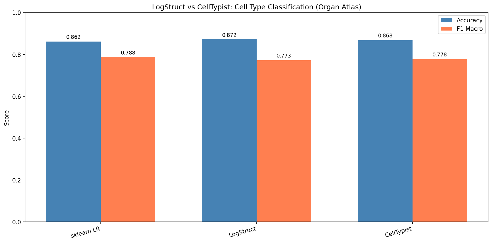
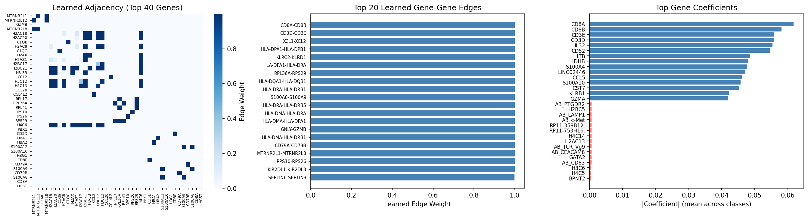

# LogStruct

**Network-structured regression for biological data**

[](https://www.python.org/downloads/)
[](https://opensource.org/licenses/MIT)

LogStruct is a scikit-learn compatible library for logistic and linear regression with **learned feature-graph smoothing**. It's designed for omics data where you have prior knowledge about feature relationships (PPI networks, pathways, gene regulatory networks).

## Why LogStruct?

Standard regularized regression (lasso, ridge, elastic net) treats features as independent. But in biology, genes don't work alone—they interact through pathways, protein complexes, and regulatory networks.

LogStruct lets you:

1. **Incorporate biological priors** — Start with a PPI network, pathway co-membership, or correlation structure
2. **Learn refined structure** — The model adjusts edge weights based on what's predictive in your data
3. **Get interpretable outputs** — Coefficients + a learned network showing which relationships matter

## Installation

```bash
pip install logstruct

# With biology extras (scanpy, anndata)
pip install logstruct[bio]

# For development
pip install logstruct[dev]
```

## Quick Start

```python
from logstruct import LogStructClassifier
from logstruct.priors import from_random

import numpy as np
from sklearn.model_selection import train_test_split

# Your data
X = np.random.randn(500, 100)  # 500 samples, 100 genes
y = (X[:, 0] + X[:, 1] > 0).astype(int)  # binary outcome

# Build a prior (or use from_pathway_gmt, from_string_db, etc.)
prior = from_random(100, density=0.1)

# Fit
clf = LogStructClassifier(
    prior_adjacency=prior,
    lambda_smooth=1.0,  # encourage connected genes to have similar coefficients
    lambda_kl=0.5,      # stay close to prior (increase if prior is reliable)
)
X_train, X_test, y_train, y_test = train_test_split(X, y, test_size=0.2)
clf.fit(X_train, y_train)

# Evaluate
print(f"Test accuracy: {clf.score(X_test, y_test):.3f}")

# Examine learned structure
top_edges = clf.get_top_edges(n=10)
print("Top learned edges:", top_edges)

# Access full learned adjacency
learned_adj = clf.adjacency_  # (n_features, n_features)
```

## Building Priors

LogStruct provides several ways to construct prior adjacency matrices:

```python
from logstruct import priors

# From pathway database (GMT format)
prior = priors.from_pathway_gmt(
    "c2.cp.kegg.v7.gmt",
    gene_names=adata.var_names,
    within_pathway_weight=0.7,
)

# From STRING protein-protein interactions
prior = priors.from_string_db(
    "9606.protein.links.v12.0.txt",
    gene_names=adata.var_names,
    score_threshold=400,  # medium confidence
)

# From gene regulatory network
prior = priors.from_grn(
    tf_target_pairs=[("TP53", "CDKN1A"), ("MYC", "CDK4", 0.9), ...],
    gene_names=adata.var_names,
)

# From data correlation (no external knowledge needed)
prior = priors.from_correlation(X, threshold=0.3)

# Uninformative baseline (let model learn from scratch)
prior = priors.from_identity(n_features, baseline=0.01)
```

## Parameters

### Key hyperparameters

| Parameter | Default | Description |
|-----------|---------|-------------|
| `lambda_en` | 1.0 | Elastic net strength (sparsity on coefficients) |
| `lambda_smooth` | 1.0 | Laplacian smoothness (connected features → similar coefficients) |
| `lambda_kl` | 1.0 | KL divergence to prior (how much to trust your prior) |
| `alpha` | 0.5 | Elastic net mixing: 0=ridge, 1=lasso |
| `temperature` | 0.8 | Adjacency sharpness (lower = more binary edges) |
| `freeze_adjacency` | False | If True, don't learn structure (use prior directly) |

### Tuning tips

- **Strong prior (validated PPI network):** High `lambda_kl` (2-10), moderate `lambda_smooth`
- **Weak prior (correlation-based):** Low `lambda_kl` (0.1-0.5), let model deviate
- **Small sample size:** Higher regularization overall, higher `lambda_kl`
- **Discovery mode:** Low `lambda_kl`, examine `clf.adjacency_` vs prior

## Regression

For continuous outcomes, use `LogStructRegressor`:

```python
from logstruct import LogStructRegressor

reg = LogStructRegressor(
    prior_adjacency=prior,
    lambda_smooth=1.0,
)
reg.fit(X_train, y_train)

y_pred = reg.predict(X_test)
r2 = reg.score(X_test, y_test)
```

## How It Works

### Smoothing operator

Before prediction, features are smoothed over the graph:

```
x_smooth = x @ S
```

where `S = I + row_normalize(A)` and `A` is the learned adjacency.

This means each gene's value becomes a weighted average of itself and its network neighbors.

### Loss function

```
L = task_loss + λ_en * elastic_net(W) + λ_smooth * Σ w^T L w + λ_kl * KL(A || A_prior)
```

- **Task loss:** Cross-entropy (classification) or MSE (regression)
- **Elastic net:** Sparsity on coefficients
- **Laplacian smoothness:** `w^T L w` penalizes large differences between coefficients of connected features
- **KL divergence:** Keeps learned adjacency close to prior

### What you get

- `clf.coef_`: Learned coefficients
- `clf.adjacency_`: Learned (sparse) adjacency matrix
- `clf.get_top_edges(n)`: Most important learned edges
- `clf.history_`: Training curves

## Example: Cell Type Classification

```python
import scanpy as sc
from logstruct import LogStructClassifier
from logstruct.priors import from_pathway_gmt

# Load data
adata = sc.read_h5ad("pbmc3k.h5ad")
sc.pp.highly_variable_genes(adata, n_top_genes=2000)
adata = adata[:, adata.var.highly_variable]

X = adata.X.toarray()
y = adata.obs["cell_type"].values

# Build prior from KEGG pathways
prior = from_pathway_gmt(
    "c2.cp.kegg.v7.5.symbols.gmt",
    gene_names=adata.var_names.tolist(),
)

# Fit
clf = LogStructClassifier(
    prior_adjacency=prior,
    lambda_smooth=1.0,
    lambda_kl=1.0,
    max_iter=100,
    verbose=True,
)
clf.fit(X, y)

# Which pathway edges are most predictive?
for i, j, w in clf.get_top_edges(20):
    print(f"{adata.var_names[i]} -- {adata.var_names[j]}: {w:.3f}")
```

## Analyzing Learned Networks

LogStruct allows you to quantify how the learned network differs from your biological prior (e.g., discovering new interactions or pruning false positives).

```python
from logstruct.analysis import compare_to_prior, print_network_report

# Run analysis
res = compare_to_prior(
    clf, 
    gene_names=adata.var_names.tolist(),
    prior_threshold=0.5,
    learned_threshold=0.1
)

# Print a formatted report
print_network_report(res)

# Access specific discoveries programmatically
for i, j, w in res['gained'][:5]:
    print(f"New Edge: {adata.var_names[i]} -- {adata.var_names[j]} (Weight {w:.3f})")
```

This will output:
- **Gained Connections:** High-weight edges in the model that were NOT in the prior (potential novel interactions).
- **Lost Connections:** High-confidence prior edges that the model pruned (irrelevant for the specific task).
- **Retained Connections:** Validated prior knowledge.

## Limitations

- **Scalability:** Dense P×P adjacency. Works well up to ~5k features. For larger, consider selecting features first.
- **Not a GNN:** This is regularized linear model with graph structure, not a graph neural network. Interpretability over raw power.
- **Edge learning is soft:** Adjacency is probabilistic, not discrete. Threshold for interpretation.

## Benchmark: LogStruct vs CellTypist

We benchmarked LogStruct against [CellTypist](https://www.celltypist.org/) (SOTA cell annotation tool) and sklearn Logistic Regression on the CellTypist Blood Organ Atlas (20k cells, 3k HVGs).

### Results

LogStruct achieves **82.0% accuracy** and **66.5% F1-macro**, approaching CellTypist performance (85.2% accuracy) while offering full interpretability.

| Model | Accuracy | F1-Macro | Training Time |
|-------|----------|----------|---------------|
| **CellTypist** | **85.2%** | **74.2%** | 44.7s |
| sklearn LR | 84.7% | 75.0% | 8.6s |
| **LogStruct** | **82.0%** | **66.5%** | 52.5s |

> **Note:** LogStruct used a STRING-DB PPI network prior, 3k HVGs (1.5k selected), and 2000 training iterations.

### Visualizations

#### Performance & Training Time


#### Learned Gene Network
LogStruct learns which biological interactions matter for the classification task:



### Interpretation

- **Competitive Accuracy:** LogStruct is within ~3% of CellTypist accuracy.
- **Interpretable:** Unlike pure linear models, LogStruct provides a sparse, weighted adjacency matrix showing gene-gene dependencies.
- **Biological Prior:** The model effectively filters a dense PPI network (1M+ edges) to the most relevant subnetworks.

## Citation

If you use LogStruct in your research:

```bibtex
@software{logstruct,
  author = {Yash Raj},
  title = {LogStruct: Network-structured regression for biological data},
  year = {2025},
  url = {https://github.com/yashraj/logstruct}
}
```

## License

MIT
